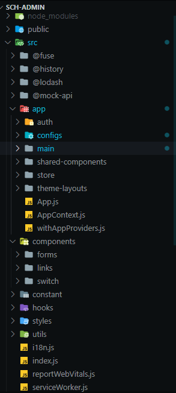
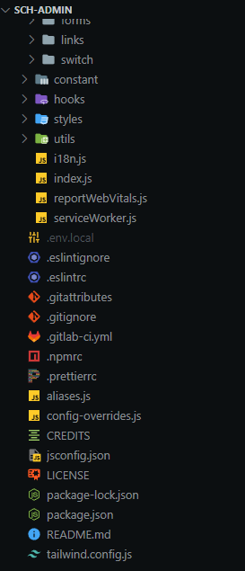

# KLC Admin
KLC Admin adalah sebuah aplikasi yang memungkinkan administrator untuk mengelola konten dan fitur yang ada dalam sebuah platform. Dengan webpanel ini, administrator dapat mengatur beasiswa, referensi, banner, dan kutipan dengan mudah.

## Fitur

- **Beasiswa**: Fitur ini memungkinkan administrator untuk menambah, mengedit, dan menghapus informasi beasiswa. Pengguna juga dapat mencari beasiswa dan mengajukan aplikasi.
- **Referensi**: Modul referensi memungkinkan administrator mengelola dan mempublikasikan referensi.
- **Banner**: Fitur ini memungkinkan administrator untuk memperbarui tampilan banner di KLC User dengan gambar atau banner yang relevan.
- **Quotes**: Modul quotes memungkinkan administrator untuk menambahkan kutipan inspiratif yang akan ditampilkan di KLC User.

## Teknologi yang Digunakan

- [React](https://reactjs.org/): Library JavaScript untuk membangun antarmuka pengguna (UI) yang interaktif.
- [Material UI](https://mui.com/): Framework UI untuk React yang mengimplementasikan desain Material Design dari Google.
- [Tailwind CSS](https://tailwindcss.com/): Framework CSS utility-first yang memungkinkan penulisan kode CSS yang cepat dan fleksibel dengan menggunakan kelas utilitas.

## Cara Menggunakan

1. Clone repositori ini ke mesin lokal Anda.
2. Buka terminal dan arahkan ke direktori proyek.
3. Jalankan perintah `npm install` untuk menginstal semua dependensi.
4. Ubah file konfigurasi sesuai kebutuhan Anda.
5. Jalankan perintah `npm start` untuk menjalankan KLC Admin di lokal Anda.

## Penambahan Swalalert2

Untuk menambahkan Swalalert2 ke dalam proyek KLC Admin, ikuti langkah-langkah berikut:

1. Instal Swalalert2: Jalankan perintah `npm install sweetalert2` dalam terminal proyek untuk menginstal library Swalalert2.
2. Impor library: Di file JavaScript yang ingin Anda gunakan Swalalert2, impor library dengan menambahkan baris berikut di bagian atas file:

   ```javascript
   import Swal from 'sweetalert2';
   
3. Gunakan Swalalert2: Anda dapat menggunakan Swalalert2 untuk menampilkan kotak dialog yang menarik dan interaktif. Berikut adalah contoh penggunaan Swalalert2:

   ```javascript
    Swal.fire({
    icon: 'success',
    title: 'Sukses',
    text: 'Data berhasil disimpan.',
    });

    
4.   Anda juga dapat menyesuaikan pesan dengan menambahkan tombol, ikon, atau elemen lainnya. Swalalert2 menyediakan banyak opsi dan metode yang dapat Anda       gunakan untuk mengubah tampilan dan perilaku kotak dialog.

     ```javascript
     Swal.fire({
       icon: 'warning',
       title: 'Konfirmasi',
       text: 'Apakah Anda yakin ingin menghapus data ini?',
       showCancelButton: true,
       confirmButtonText: 'Ya',
       cancelButtonText: 'Batal',
     }).then((result) => {
       if (result.isConfirmed) {
         // Tindakan yang akan dijalankan jika pengguna menekan tombol 'Ya'
       }
     });

Pastikan untuk mengikuti petunjuk instalasi dan konfigurasi yang tepat sebelum menjalankan aplikasi ini. Pastikan juga untuk memperbarui file README.md dengan informasi yang lebih detail sesuai dengan kebutuhan.

# Struktur Folder KLC-Admin

Berikut adalah tangkapan layar struktur folder program KLC-Admin:

| Gambar 1                      | Gambar 2                      |
|------------------------------|------------------------------|
|  |  |


### Langkah-langkah:

1. Buka direktori proyek KLC Admin.
2. Buka folder `src`.
3. Di dalam folder `src`, terdapat folder `@fuse` `@lodash` `app` dan `components `.
4. Folder `@fuse` dalam Fuse Material FuseTheme adalah direktori yang berisi kode inti dan konfigurasi yang dikembangkan oleh tim Fuse. Ini berfungsi sebagai kerangka kerja yang menyediakan fitur dan fungsionalitas yang umum digunakan dalam pengembangan aplikasi web.
5. Folder `@lodash` dalam Fuse Material FuseTheme merupakan folder yang berisi modul-modul Lodash yang digunakan dalam proyek tersebut. Lodash adalah sebuah utilitas JavaScript yang populer dan serbaguna, yang menyediakan berbagai fungsi dan metode yang dapat membantu dalam manipulasi dan pengolahan data.
6. Folder `app` berisi komponen-komponen dan layanan yang digunakan dalam aplikasi.
   - Di dalam folder `components`, terdapat folder `main` yang berisi komponen-komponen utama aplikasi.
   - Di dalam folder `components`, terdapat folder `Pages` yang berisi komponen-komponen halaman aplikasi, seperti halaman otentikasi (login, register) dan halaman dashboard.
   - File `App.js` adalah file utama yang merangkum komponen-komponen aplikasi.
   - Di dalam folder `services`, terdapat file `authService.js` yang berisi layanan untuk otentikasi.
7. Folder `assets` berisi aset-aset yang digunakan dalam aplikasi, seperti gambar dan gaya.
   - Di dalam folder `images`, terdapat gambar-gambar yang digunakan dalam aplikasi.
   - Di dalam folder `styles`, terdapat file `app.css` yang berisi gaya-gaya CSS tambahan yang diterapkan pada aplikasi.
8. File `index.js` digunakan untuk menyatukan dan merender aplikasi ke dalam DOM.
9. File `themeConfig.js` berisi konfigurasi tema dan pengaturan aplikasi.

Dengan struktur folder yang terorganisir seperti di atas, komponen, layanan, dan aset dapat dengan mudah diidentifikasi dan dikelola.


